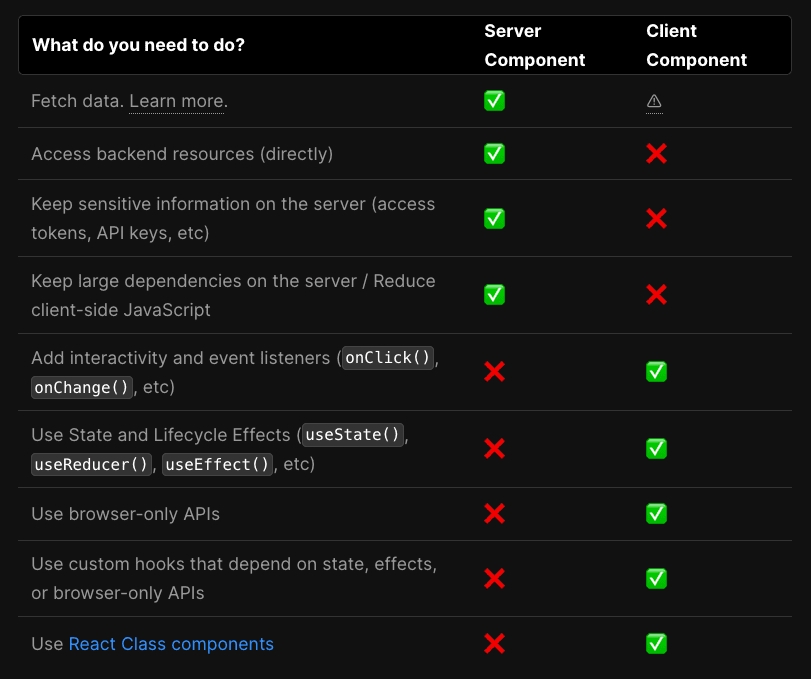

## 사용한 라이브러리

<div align="center">

| 라이브러리                      | 버전     | 라이브러리         | 버전     |
| ------------------------------- | -------- | ------------------ | -------- |
| @babel/core                     | ^7.22.11 | clsx               | ^2.0.0   |
| @babel/plugin-syntax-typescript | ^7.22.5  | eslint             | 8.47.0   |
| @babel/preset-env               | ^7.22.10 | eslint-config-next | 13.4.19  |
| @types/node                     | 20.5.6   | lucide-react       | ^0.268.0 |
| @types/react                    | 18.2.21  | next               | 13.4.19  |
| @types/react-dom                | 18.2.7   | postcss            | 8.4.28   |
| autoprefixer                    | 10.4.15  | react              | 18.2.0   |
| babel-jest                      | ^29.6.4  | react-dom          | 18.2.0   |
| babel-loader                    | ^9.1.3   | react-icons        | ^4.10.1  |
| babel-plugin-macros             | ^3.1.0   | tailwind-merge     | ^1.14.0  |
| babel-plugin-styled-components  | ^2.1.4   | tailwindcss        | 3.3.3    |
| babel-plugin-twin               | ^1.1.0   | twin.macro         | ^3.4.0   |

</div>

## Font 컨벤션

### 글씨체

`나눔스퀘어`와 `나눔고딕`사용

-   globals.css

```css
@font-face {
    font-family: 'NanumGothic';
    src: url('http://fonts.googleapis.com/earlyaccess/nanumgothic.css') format('css');
    font-weight: normal;
    font-style: normal;
}

@font-face {
    font-family: 'NanumSquare';
    src: url('https://cdn.jsdelivr.net/gh/moonspam/NanumSquare@2.0/nanumsquare.css') format('css');
    font-weight: normal;
    font-style: normal;
}
```

### fontWeight 및 pxr 설정

-   next.config.js

```javascript
        fontFamily: {
            NanumGothic: ['NanumGothic'],
            NanumSquare: ['NanumSquare'],
        },
        fontWeight: {
            tiny: '200',
            normal: '400',
            bold: '800',
        },
```

## docs파일에 정리

<details>

<summary>pxr 문서</summary>

# 새로운 단위 정의하기

대부분의 브라우저는 디폴트 폰트 사이즈로 16px의 폰트 크기를 가지지만, 브라우저의 접근성 설정에서 디폴트 폰트 크기를 바꿀 수 있는 기능을 제공합니다.
하지만 유저가 웹사이트의 글씨를 더 크게 보고 싶어서 이 설정을 조정한다고 해도 웹사이트의 모든 단위가 px로 설정되어 있다면 아무것도 바뀌지 않게 됩니다.
디폴트 폰트 사이즈가 변경된다고 해서 우리가 직접 요소들에 넣어준 px 크기가 변경되지 않기 때문입니다.

카카오팀에서 집중했던 부분은 rem입니다. rem은 최상위 엘리먼트(html)에 지정된 폰트 사이즈를 기준으로 크기가 결정되는데
최상위 엘리먼트에 폰트 사이즈를 임의로 명시하지 않으면 브라우저 기본값 (보통 16px)을 기준으로 크기가 결정됩니다.
(1rem = 16px). rem을 사용한다면 유저가 브라우저 설정의 ‘접근성’ 기능을 통해 디폴트 텍스트 크기를 조정했을 때
그에 따라 rem의 크기도 함께 변경되기 때문에 유저가 의도한 동작을 지원할 수 있게 됩니다.

카카오 팀은 `pxr`이라는 새로운 단위를 만들어 도입.
이 pxr 단위를 사용하면 디자인에 명시된 px 값을 그대로 사용할 수 있으며
(16pxr = 16px), 실제 페이지에는 rem 단위로 치환되어 적용되게 됩니다 (16pxr = 1rem).

```javascript
// tailwind.config.js

const pxToRem = (px, base = 16) => `${px / base}rem`;

module.export = {
  ...
  theme: {
    ...
    spacing: {
      ...range(1, 100).reduce((acc, px) => {
        acc[`${px}pxr`] = pxToRem(px);
        return acc;
      }, {}),
    }
  }
}
```

우린 카카오팀에서 만든 pxr의 설정을 조금 바꾸어 변경하였습니다.

```javascript
const pxToRem = (px, base = 16) => `${px / base}rem`
const range = (start, end) => Array.from({ length: end - start + 1 }, (_, index) => index + start)
const getPxr = (end) => range(1, end).map((_, i) => pxToRem(i))
const pxr10 = getPxr(10)
const pxr100 = getPxr(100)
const pxr200 = getPxr(200)
const pxr500 = getPxr(500)

(...)

        extend: {
            spacing: pxr500,
            fontSize: pxr100,
            borderWidth: pxr10,
            lineHeight: pxr100,
            minWidth: pxr200,
            minHeight: pxr100,
            backgroundImage: {
                'gradient-radial': 'radial-gradient(var(--tw-gradient-stops))',
                'gradient-conic': 'conic-gradient(from 180deg at 50% 50%, var(--tw-gradient-stops))',
            },
        },
    },
    plugins: [require('flowbite/plugin')],
}
export default config
```

자세한 내용은 다음 출처를 확인하세요.

[FE개발그룹에서는 Tailwind CSS를 왜 도입했고, 어떻게 사용했을까?](https://fe-developers.kakaoent.com/2022/221013-tailwind-and-design-system/)

</details>

<details>

<summary>twin.macro 도입 문서</summary>

# 개요

twin.macro를 도입하여 스타일링을 적용하는 방법을 기록. twin.macro는 Tailwind CSS와 Emotion을 중첩적으로 사용하여 동적 스타일링을 편리하게 처리할 수 있도록 도와주는 도구입니다. 위의 내용을 토대로 다시 요약하자면 다음과 같습니다.

1.  @emotion/react 및 @emotion/styled 라이브러리를 설치합니다.
2.  twin.macro를 설치합니다.
3.  withTwin.js 파일을 생성하여 webpack 설정을 추가합니다.
4.  next.config.js 설정 파일에서 withTwin을 적용합니다.
5.  타입 선언 파일(twin.d.ts)을 작성하여 twin.macro에서 사용하는 타입을 선언합니다.
6.  tsconfig.json 파일에 types 속성을 추가하여 타입 선언 파일을 포함시킵니다.
7.  컴포넌트에서 twin.macro를 사용하여 동적 스타일링을 적용합니다.
8.  또한, twin.macro를 사용하여 스타일을 적용하는 예시 코드도 포함되어 있습니다. 이 예시 코드는 twin.macro와 Tailwind CSS를 사용하여 컴포넌트의 스타일링을 처리하는 방법을 설명하고 있습니다.

# Nextjs13 twin.macro 도입

기존 emotion을 통한 CSS-in-JS 방식에서 단순한 컴포넌트의 HTML 코드 보다 스타일 코드가 더 복잡한 경우를 경험하였다.

스타일 코드가 실제 기능 코드의 가독성을 해친다고 생각하여 tailwindCSS를 사용하게 되었다.
emotion을 사용하며 불편했던 문제들을 다소 해소할 수 있었고 마크업 작성도 보다 쉽게 할 수 있었지만 불편한점을 발견하였다.

바로 동적 스타일링이였다.

가변적인 변수를 받아와 스타일을 적용해야하는 경우 tailwindCSS는 한계가 있었다. 이러한 트러블 슈팅을 해결하기 위해 방안을 찾아보던중 twin.macro에 대해 알게 되었고, twin.macro는 tailwindCSS와 emotion을 중첩적으로 유연하게 사용가능하게 해주었다.

나의 프로젝트에 twin.macro를 도입하여 적용한 과정을 기록해보려고 한다.
(기존 나의 프로젝트 환경은 nextjs 13 + typescript + tailwindCSS가 이미 구성되어있다는 가정하에 설치하도록 하자.)

```bash
npm i @emotion/react @emotion/styled
npm i -S @emotion/serialize
npm i -D twin.macro @emotion/babel-plugin babel-plugin-macros @babel/plugin-syntax-typescript @babel/preset-react
```

이 때, 후에 한 번 더 설명하겠지만, `npm i @emotion/react @emotion/styled` 및 `npm i -S @emotion/serialize`는 포함하지 않아도 됀다
자세한 얘기는 후에 다루겠다.

최상위 루트에 withTwin.js 파일을 생성한다.

### withTwin.js

```javascript
/* eslint-disable no-param-reassign */
const path = require('path')

const includedDirs = [path.resolve(__dirname, 'src')]

module.exports = function withTwin(nextConfig) {
    return {
        ...nextConfig,
        webpack(config, options) {
            const { dev, isServer } = options
            config.module = config.module || {}
            config.module.rules = config.module.rules || []
            config.module.rules.push({
                test: /\.(tsx|ts)$/,
                include: includedDirs,
                use: [
                    options.defaultLoaders.babel,
                    {
                        loader: 'babel-loader',
                        options: {
                            sourceMaps: dev,
                            presets: [
                                ['@babel/preset-react', { runtime: 'automatic', importSource: '@emotion/react' }],
                            ],
                            plugins: [
                                require.resolve('babel-plugin-macros'),
                                require.resolve('@emotion/babel-plugin'),
                                [require.resolve('@babel/plugin-syntax-typescript'), { isTSX: true }],
                            ],
                        },
                    },
                ],
            })

            if (!isServer) {
                config.resolve.fallback = {
                    ...(config.resolve.fallback || {}),
                    fs: false,
                    module: false,
                    path: false,
                    os: false,
                    crypto: false,
                }
            }

            if (typeof nextConfig.webpack === 'function') {
                return nextConfig.webpack(config, options)
            }
            return config
        },
    }
}
```

그 후에 최상위 루트의 `next.config.js`설정 파일에 다음과 같이 webpack 설정을 적용해준다.

```typescript
const withTwin = require('./withTwin')

/** @type {import('next').NextConfig} */
const nextConfig = withTwin({
    reactStrictMode: true,
})

module.exports = nextConfig
```

이 때, [twin.d.ts](../src/types/twin.d.ts)를 보자면

```typescript
import 'twin.macro'
import styledImport, { CSSProp, css as cssImport } from 'styled-components'

declare module 'twin.macro' {
    // The styled and css imports
    const styled: typeof styledImport
    const css: typeof cssImport
}
declare module 'react' {
    // The css prop
    interface HTMLAttributes<T> extends DOMAttributes<T> {
        css?: CSSProp
        tw?: string
    }
    // The inline svg css prop
    interface SVGProps<T> extends SVGProps<SVGSVGElement> {
        css?: CSSProp
        tw?: string
    }
}

// The 'as' prop on styled components
declare global {
    namespace JSX {
        interface IntrinsicAttributes<T> extends DOMAttributes<T> {
            as?: string | Element
        }
    }
}
```

자세한건 모르지만, styled-components 내장 객체에서 해당 속성 객체를 가져와도 무방함.

이러한 type 선언에 대해 살펴보도록 `tsconfig.json`파일에 `types`속성을 추가한다.

```json
{
    "compilerOptions": {
        "target": "es5",
        "lib": ["dom", "dom.iterable", "esnext"],
        "allowJs": true,
        "skipLibCheck": true,
        "strict": true,
        "forceConsistentCasingInFileNames": true,
        "noEmit": true,
        "esModuleInterop": true,
        "module": "esnext",
        "moduleResolution": "node",
        "resolveJsonModule": true,
        "isolatedModules": true,
        "jsx": "preserve",
        "incremental": true,
        "paths": {
            "@/*": ["./src/*"]
        }
    },
    "include": ["next-env.d.ts", "**/*.ts", "**/*.tsx"],
    "exclude": ["node_modules"],
    "types": ["types"] // type 선언 추가
}
```

# 테스트

```jsx
import { useState } from 'react'
import tw, { css } from 'twin.macro'

const Home = () => {
    const [value, setValue] = useState(0)

    return (
        <div>
            <h2>max value === 3</h2>
            <span
                css={[
                    tw`text-[36px] block`,
                    css`
                        color: ${value === 3 && 'hotpink'};
                    `,
                ]}
            >
                {value}
            </span>
            <button type="button" onClick={() => setValue((prev) => prev + 1)} className="text-[36px] bolder-[1px]">
                +
            </button>

            <button type="button" onClick={() => setValue((prev) => prev - 1)} className="text-[36px]">
                -
            </button>
        </div>
    )
}
export default Home
```

원래 위의 코드를 좀 가져와서 테스트를 하려고 했는데 쉽게 와닿지가 않는다
그래서 아래와 같이 다시 써보겠다

```tsx
'use client'

import tw, { css } from 'twin.macro'
import React from 'react'

interface TestProps {
    width: number
    height: number
}
const Test: React.FC<TestProps> = ({ width, height }) => {
    return (
        <>
            <div className={`w-[${width}px] h-[${height}px]`}>안녕하세요</div>
        </>
    )
}

export default Test
```

위의 코드가 올바르게 들어갈까?


적용이 되질 않는다...
tailwind는 이러한 동적할당이 적용되지 않는다
따라서 twin.macro와 같은 라이브러리를 사용하여 해결하는 것
자세한 해결 처리 과정은 아래 사이트를 참고하시길 바란다.

## 해결 방법

```tsx
'use client'

import tw, { css } from 'twin.macro'
import React from 'react'

interface TestProps {
    width?: number
    height?: number
}
const Test: React.FC<TestProps> = ({ width, height }) => {
    return (
        <>
            <div
                css={[
                    tw`w-full h-full`,
                    {
                        width: width,
                        height: height,
                    },
                ]}
            >
                안녕하세요
            </div>
        </>
    )
}

export default Test
```

이렇게 Props를 동적으로 할당받아 값을 가변적으로 변경할 수 있다.

## 문자열 템플릿을 사용하여 동적 할당

```tsx
'use client'

import tw, { css } from 'twin.macro'
import React from 'react'

interface TestProps {
    width?: number
    height?: number
}

const Test: React.FC<TestProps> = ({ width, height }) => {
    // 동적으로 할당할 스타일을 생성합니다.
    const dynamicStyle = css`
        width: ${width}px;
        height: ${height}px;
    `

    return (
        <>
            <div css={dynamicStyle}>안녕하세요</div>
        </>
    )
}

export default Test
```

### 다음 참고 사이트를 참고

[Nextjs13 twin.macro 도입](https://velog.io/@codenmh0822/Nextjs13-twin.macro-%EB%8F%84%EC%9E%85)

</details>

<details>

<summary>clsx & tailwind-merge 문서</summary>

# clsx

### [clsx](https://github.com/lukeed/clsx)

clsx의 깃허브는 다음 링크를 타고 가면 됩니다.
JavaScript로 작성된 228B의 작은 라이브러리입니다.

## 사용 방법

`npm install --save clsx`

```javascript
import clsx from 'clsx'
// or
import { clsx } from 'clsx'

// Strings (variadic)
clsx('foo', true && 'bar', 'baz')
//=> 'foo bar baz'

// Objects
clsx({ foo: true, bar: false, baz: isTrue() })
//=> 'foo baz'

// Objects (variadic)
clsx({ foo: true }, { bar: false }, null, { '--foobar': 'hello' })
//=> 'foo --foobar'

// Arrays
clsx(['foo', 0, false, 'bar'])
//=> 'foo bar'

// Arrays (variadic)
clsx(['foo'], ['', 0, false, 'bar'], [['baz', [['hello'], 'there']]])
//=> 'foo bar baz hello there'

// Kitchen sink (with nesting)
clsx('foo', [1 && 'bar', { baz: false, bat: null }, ['hello', ['world']]], 'cya')
//=> 'foo bar hello world cya'
```

## 장점

이 clsx는 조건부 렌더를 작성하기 쉬워지는 장점을 제공해줍니다.

## TypeScript에서는?

```javascript
import { ClassValue, clsx } from 'clsx'
```

ClassValue 타입을 import해올 수 있습니다.
이 ClassValue에 대한 정의로 가보면 굉장히 심플한 타입을 갖고 있는 것을 볼 수 있습니다.

```jsx
export type ClassValue = ClassArray | ClassDictionary | string | number | null | boolean | undefined;
export type ClassDictionary = Record<string, any>;
export type ClassArray = ClassValue[];

export declare function clsx(...inputs: ClassValue[]): string;
export default clsx;
```

대충 여러가지를 유니온타입으로 받을 수 있게 해두었는데
import해서 사용할 수 있게 제공을 해주네요!
대부분 유저들은 유틸함수화 시켜 사용하고 있답니다

```jsx
import { ClassValue, clsx } from 'clsx'
import { twMerge } from 'tailwind-merge'

export function cn(...inputs: ClassValue[]) {
    return twMerge(clsx(inputs))
}
```

# tailwind-merge

[https://github.com/dcastil/tailwind-merge](https://github.com/dcastil/tailwind-merge)
[github.com](https://github.com/dcastil/tailwind-merge)

github는 다음 링크를 따라가면 확인하실 수 있습니다.
대체로 typescript를 이용하여 작성되었고
현재 포스트를 작성하는 시점에는 v.3.0 up to v3.3까지 지원이 되네요
(참고로 2023/05/20 기준 tailwindcss는 3.3~ version까지 나와있는 상태입니다.)
버전 지원도 잘 되고 있고

[https://www.npmjs.com/package/tailwind-merge](https://www.npmjs.com/package/tailwind-merge)
[tailwind-merge](https://www.npmjs.com/package/tailwind-merge)

npm을 확인해보면 주간 다운로드수가 30만 가까이 나오고 있네요
꽤 믿을만한 오픈소스 프로젝트로 보입니다.
사용법은 먼저 install을 하는것으로 시작됩니다.

    npm i tailwind-merge
    yarn add tailwind-merge

각자 사용하고 있는 패키지매니저에 맞는 명령어를 입력해주면 됩니다.
물론 tailwind를 사용하는 환경이어야 하겠죠?

---

## [😙이거 왜 사용하면 좋은 것일까요?](https://xionwcfm.tistory.com/322#%F0%9F%98%99%EC%9D%B4%EA%B1%B0%20%EC%99%9C%20%EC%82%AC%EC%9A%A9%ED%95%98%EB%A9%B4%20%EC%A2%8B%EC%9D%80%20%EA%B2%83%EC%9D%BC%EA%B9%8C%EC%9A%94%3F-1)

tailwind-merge의 What is it for 문서를 읽어보면 다음과 같은 근거를 들어 설명합니다.

> React, Vue와 같은 컴포넌트 기반 라이브러리와 함께 tailwind css 를 사용하는 경우에는  
> 컴포넌트의 일부 스타일을 오직 한곳에서만 변경하고 싶은 상황에 익숙할 것입니다!

    // React components with JSX syntax used in this example

    function MyGenericInput(props) {
        const className = `border rounded px-2 py-1 ${props.className || ''}`
        return <input {...props} className={className} />
    }

    function MySlightlyModifiedInput(props) {
        return (
            <MyGenericInput
                {...props}
                className="p-3" // ← Only want to change some padding
            />
        )
    }

바로 이런 상황을 이야기합니다.

저도 실제로 tailwindcss를 사용하면서 많이 겪는 상황 중 하나인데

이미 MyGenericInput은 px-2, py-1을 가지고 있습니다.

className에 있는 순서는 하나도 중요하지않다는 것은 쉽게 알 수 있습니다.

[https://fe-developers.kakaoent.com/2022/220303-tailwind-tips/](https://fe-developers.kakaoent.com/2022/220303-tailwind-tips/)

혹시 이에대한 참고가 필요하신 분들은 위 링크를 참고하시기 바랍니다.

하여간 그런 탓에 위 예제에서 p-3를 props로 넘겨주었고

p-3가 적용되기를 기대하지만 css의 캐스케이딩 방식 때문에 적용되지 않습니다.

여기서 p-3스타일을 적용시키기 위해서는 px-2와 py-1을 제거해야만 합니다.

이러한 문제를 tailwind-merge가 해결해주는거에요!

    function MyGenericInput(props) {
        // ↓ Now `props.className` can override conflicting classes
        const className = twMerge('border rounded px-2 py-1', props.className)
        return <input {...props} className={className} />
    }

tailwind-merge가 제공하는 twMerge함수를 이용하면 다음과 같은 작성할 수 있습니다.

이렇게 기존 클래스와 충돌하게 되는 클래스를 tailwind-merge는 override를 수행해주고

우리가 기대한것처럼 p-3로 패딩값을 바꾸어서 렌더링합니다.

---

## [Features](https://xionwcfm.tistory.com/322#Features-1)

기본적으로 result는 캐싱되기 때문에 불필요한 리렌더링을 걱정하지 않아도 됩니다.

이 라이브러리는 내부적으로 LRU cache 알고리즘을 사용하고 있고

캐시 사이즈를 만약 수정하고 싶다면 extendTailwindMerge를 사용하면 됩니다.

캐시힛 없이 twMerge호출이 빠르게 유지될 수 있도록 비싼 계산은 upfront로 수행한다고하네요

이부분은 구현에 가까운 내용이니 일단은 이정도만 알고 넘어가도록 합시다.

이 tailwind-merge가 제공하는 강력한 기능은 다음과 같습니다.

실제로는 더 많은 기능을 제공해주고 있지만

당장 사용하고 싶은 사람의 입장에서 크게 눈에 띄는 기능은 이것입니다.

Last Conflicting Class Wins

이름에서 눈치 챌 수 있듯이 맨 마지막에 적용시킨 클래스가  
win , 적용된다는 뜻입니다.

나머지 기능들은 대부분 tailwindcss에서도 지원해주는 기능을 호환시켜주는 내용인데

맨 마지막에 적용시킨 클래스가 적용되는 기능이 아주 매력적이죠!

    twMerge('p-5 p-2 p-4') // → 'p-4'

이러한 tailwind-merge는 별도의 설정 없이 일반적으로 tailwind css를 사용하고 있는 경우에는

바로 사용할 수 있기 때문에 설치하고 import해서 바로 사용하면 끝입니다.

다만 이것저것 커스텀해서 사용하고 계신 경우에는

라이브러리에서 제공해주는 extendTailwindMerge 함수를 사용해야 할 수 있습니다.

이에 관해서는 공식문서를 참고해보시기 바랍니다.

주의사항으로는 tailwind-merge로 충분한 클래스에

**@apply 지시문을 사용하는 것이 추천되지 않는다는 것**입니다.

---

## [실제 사용법](https://xionwcfm.tistory.com/322#%EC%8B%A4%EC%A0%9C%20%EC%82%AC%EC%9A%A9%EB%B2%95-1)

    import { twMerge } from 'tailwind-merge'
    const className = twMerge('p-2 p-3 p-4')
    return <div className={className}>안녕하세요</div>

굉장히 간단합니다. 클래스 충돌 시병합을 도와주는 twMerge 이외에도

충돌을 해결하지 않으면서 조건부로 join을 하는 것을 도와주는 twJoin도 있습니다.

twJoin의 사용방법은 다음과 같습니다.

    twJoin(
        'border border-red-500',
        hasBackground && 'bg-red-100',
        hasLargeText && 'text-lg',
        hasLargeSpacing && ['p-2', hasLargeText ? 'leading-8' : 'leading-7'],
    )

twJoin도 굉장히 유용하게 사용할 수 있겠다는 생각이 들지 않나요?

저걸.. 하나하나 다 쌩 tailwind로 구현하려고하면 꽤나 귀찮아지지만

훨씬 읽기 쉽게 코드가 변한것을 알 수 있습니다.

---

## [😐마치며](https://xionwcfm.tistory.com/322#%F0%9F%98%90%EB%A7%88%EC%B9%98%EB%A9%B0-1)

tailwindcss를 사용하면서 편하다는 생각이 있었지만

이 병합충돌 문제가 많이 불편하게 느껴졌었습니다.

이러한 문제를 해결할 수 있는 라이브러리를 찾아서 기분이 좋네요!

이후에 더 유용하게 tailwind merge를 사용하는 방법도 포스트하겠습니다.

1.  [참고사이트](https://xionwcfm.tistory.com/322)
2.  [참고사이트](https://xionwcfm.tistory.com/323)
3.  [참고사이트](https://xionwcfm.tistory.com/325)

</details>

<details>

<summary>clsx & tailwind-merge을 활용한 버튼 예제 문서</summary>

# 버튼 컴포넌트

기준은 재사용성 및 유지 보수의 용이함

```jsx
import { cn } from '@/app/lib/utils'
```

[Title](../../lib/README.md) 참조 바람

### ButtonProps 타입 및 색깔 크기

ButtonProps 타입은 Button 컴포넌트에 전달되는 예상 속성을 정의합니다. isLoading, isDarkBg, disabled, variant, size와 같은 선택적 속성을 포함하며, 기타 버튼 관련 속성도 포함합니다.

```typescript
const ButtonVariant = ['primary', 'outline', 'ghost', 'light', 'dark'] as const
const ButtonSize = ['sm', 'base'] as const

type ButtonProps = {
    isLoading?: boolean
    isDarkBg?: boolean
    disabled?: boolean
    variant?: keyof typeof ButtonVariant
    size?: keyof typeof ButtonSize
} & React.ComponentPropsWithRef<'button'>
```

## 조건부 렌더링으로 컴포넌트 생성

각 props에 따라서 버튼의 특성을 달리하여 재사용성을 높히기 위한 색깔과 타입을 정함

```jsx
const Button = React.forwardRef<HTMLButtonElement, ButtonProps>(
  (
    {
      variant = 'primary',
      size = 'base',
      isDarkBg = false,
    },
    ref
  ) => {
  return (
    <div className="relative overflow-auto rounded-xl p-8">
      <div className="flex items-center justify-center">
        <span className="relative inline-flex">
          <button
            ref={ref}
            type="button"
            className={cn(
                "inline-flex items-center rounded-md bg-white px-4 py-2 text-sm font-semibold leading-6 text-sky-500 shadow ring-1 ring-slate-900/10 transition duration-150 ease-in-out",
              [
                size === 'base' && ['px-4 py-2', 'text-sm md:text-base'],
                size === 'sm' && ['px-2 py-1', 'text-xs md:text-sm'],
              ],
            [
            variant === 'primary' && [
              'bg-primary-500 text-black',
              'border-primary-600 border',
              'hover:bg-primary-600 hover:text-sky-400',
              'active:bg-primary-700',
              'disabled:bg-primary-700',
            ],
            variant === 'outline' && [
              'text-primary-500',
              'border-primary-500 border',
              'hover:bg-primary-50 active:bg-primary-100 disabled:bg-primary-100',
            isDarkBg &&
                'hover:bg-gray-900 active:bg-gray-800 disabled:bg-gray-800',
            ],
            variant === 'ghost' && [
              'text-primary-500',
              'shadow-none',
              'hover:bg-primary-50 active:bg-primary-100 disabled:bg-primary-100',
            isDarkBg &&
                'hover:bg-gray-900 active:bg-gray-800 disabled:bg-gray-800',
            ],
            variant === 'light' && [
              'bg-white text-gray-700',
              'border border-gray-300',
              'hover:text-dark hover:bg-gray-100',
              'active:bg-white/80 disabled:bg-gray-200',
            ],
            variant === 'dark' && [
              'bg-gray-900 text-white',
              'border border-gray-600',
              'hover:bg-gray-800 active:bg-gray-700 disabled:bg-gray-700',
            ],
          ],
            )}
            // disabled={disabled}
          >
            Transactions
          </button>
          <span className="absolute right-[-5%] top-[-10%] -mr-1 -mt-1 flex h-5 w-5">
            <span className="absolute inline-flex h-full w-full animate-bounce rounded-full bg-sky-400"></span>
          </span>
        </span>
      </div>
    </div>
    );
  }
);
export default Button;
```

### 아무래도 이렇게 작성하면 유지보수에 별로 좋지 않음...

# 동적 버튼 컴포넌트

이 컴포넌트는 React와 Tailwind CSS를 활용하여 만든 동적 버튼 컴포넌트입니다. 이 컴포넌트를 사용하면 제공된 속성에 기반하여 다양한 스타일과 크기의 버튼을 동적으로 생성할 수 있습니다.

## 코드 설명

아래는 `Button` 컴포넌트 코드에서 주요 부분을 설명한 것입니다.

### ButtonVariant 객체 구조

`ButtonVariant` 객체는 선택한 크기에 따라 해당 버튼 스타일(변형)을 정의하며 각각의 클래스를 포함합니다.

```jsx
const ButtonVariant = {
    primary: {
        base: [
            // ... 기본 크기의 주 버튼 클래스
        ],
        sm: [
            // ... 작은 크기의 주 버튼 클래스
        ],
        // ... 다른 변형과 크기
    },
    // ... 다른 변형
}
```

### ButtonSize 객체 구조

마찬가지로 `ButtonSize` 객체는 버튼 크기와 해당 클래스를 정의합니다.

```jsx
const ButtonSize = {
    base: ['px-4 py-2', 'text-sm md:text-base'],
    sm: ['px-2 py-1', 'text-xs md:text-sm'],
}
```

### Button 컴포넌트

Button 컴포넌트는 제공된 속성을 사용하여 버튼의 스타일을 동적으로 생성합니다. cn 유틸리티 함수를 사용하여 클래스 이름을 연결합니다. 버튼의 스타일은 선택한 variant, size, isDarkBg 속성에 따라 결정됩니다.

```jsx
const Button = React.forwardRef<HTMLButtonElement, ButtonProps>(
  (
    {
      variant = 'primary',
      size = 'base',
      isDarkBg = false,
    },
    ref
  ) => {
    return (
      <div className="relative overflow-auto rounded-xl p-8">
        <div className="flex items-center justify-center">
          <span className="relative inline-flex">
            <button
              ref={ref}
              type="button"
              className={cn(
                // ... 기본 버튼 클래스
                ButtonSize[size],
                ...ButtonVariant[variant][size], // 스프레드 연산자를 사용하여 클래스 포함
                isDarkBg && ['hover:bg-gray-900', 'active:bg-gray-800', 'disabled:bg-gray-800'], // 여기에 isDarkBg 클래스 추가
              )}
              // disabled={disabled}
            >
              Transactions
            </button>
            <span className="absolute right-[-5%] top-[-10%] -mr-1 -mt-1 flex h-5 w-5">
              <span className="absolute inline-flex h-full w-full animate-bounce rounded-full bg-sky-400"></span>
            </span>
          </span>
        </div>
      </div>
    );
  }
);

export default Button;
```

</details>

<details>

<summary>twin.macro & tailwind를 이용한 props 동적 할당 guide</summary>

# The prop styling guide

본 글은 다음 참고 사이트의 번역입니다.

[The prop styling guide](https://github.com/ben-rogerson/twin.macro/blob/master/docs/prop-styling-guide.md)

보간이란?

그냥 문자열 템플릿을 사용하여 동적으로 값을 끼워맞추는것을 의미함
파파고로 번역해서 보간이라는 단어가 많이 나올 것임.

## Basic styling

Twin의 two prop을 사용하여 tailwind 클래스를 jsx 요소에 추가합니다:

```js
import 'twin.macro'

const Component = () => (
    <div tw="flex w-full">
        <div tw="w-1/2"></div>
        <div tw="w-1/2"></div>
    </div>
)
```

-   조건부 스타일이 필요하지 않은 경우 "tw" 프로퍼티 사용
-   `twin.macro`에서 가져오면 "tw" 프로퍼티가 활성화됩니다.
-   Remove the need for an import with [babel-plugin-twin](https://github.com/ben-rogerson/babel-plugin-twin)

## Conditional styling

조건 스타일을 추가하려면 스타일을 배열에 내포하고 `css` "prop"을 사용합니다:

```js
import tw from 'twin.macro'

const Component = ({ hasBg }) => (
    <div
        css={[
            tw`flex w-full`, // 기본 스타일을 먼저 추가
            hasBg && tw`bg-black`, // 그 다음 조건부 스타일 추가
        ]}
    >
        <div tw="w-1/2" />
        <div tw="w-1/2" />
    </div>
)
```

<details>

<summary>타입스크립트 예시</summary>

```tsx
import tw from 'twin.macro'

interface ComponentProps {
    hasBg?: string
}

const Component = ({ hasBg }: ComponentProps) => (
    <div
        css={[
            tw`flex w-full`, // 기본 스타일을 먼저 추가
            hasBg && tw`bg-black`, // 그 다음 조건부 스타일 추가
        ]}
    >
        <div tw="w-1/2" />
        <div tw="w-1/2" />
    </div>
)
```

</details>

-   트윈은 'css prop'을 소유하고 있지 않으며, 'prop'은 당신의 css-in-js 라이브러리에서 가져온 것입니다
-   배열에 값을 추가하면 기본 스타일, 조건 및 'vanilla css'를 쉽게 정의할 수 있습니다
-   여러 줄을 사용하여 백틱 내에서 스타일을 구성할 수 있습니다 ([template literals](https://developer.mozilla.org/en-US/docs/Web/JavaScript/Reference/Template_literals))

## Overriding styles

css prop 뒤에 `tw` prop을 사용하여 우선 스타일을 추가합니다:

```js
import tw from 'twin.macro'

const Component = () => (
    <div css={tw`text-white`} tw="text-black">
        Has black text
    </div>
)
```

## Keeping jsx clean

테일윈드 클래스 세트가 커지면 다른 jsx 프로퍼티의 가독성을 방해합니다.
jsx를 정리하려면 스타일을 들어 올려 개체의 명명된 항목으로 그룹화합니다.

```js
import tw from 'twin.macro'

const styles = {
    container: ({ hasBg }) => [
        tw`flex w-full`, // 기본 스타일을 먼저 추가
        hasBg && tw`bg-black`, // 그 다음 조건부 스타일 추가
    ],
    column: tw`w-1/2`,
}

const Component = ({ hasBg }) => (
    <section css={styles.container({ hasBg })}>
        <div css={styles.column} />
        <div css={styles.column} />
    </section>
)
```

<details>
  <summary>타입스크립트 예시</summary>

```js
import tw from 'twin.macro'

interface ContainerProps {
    hasBg?: boolean;
}

const styles = {
    container: ({ hasBg }: ContainerProps) => [
        tw`flex w-full`, // Add base styles first
        hasBg && tw`bg-black`, // Then add conditional styles
    ],
    column: tw`w-1/2`,
}

const Component = ({ hasBg }: ContainerProps) => (
    <section css={styles.container({ hasBg })}>
        <div css={styles.column} />
        <div css={styles.column} />
    </section>
)
```

</details>

## Variants with many values

변형에 많은 값(eg:`variant="light/dark/etc"`),이 있을 경우, 객체에 있는 클래스의 이름을 지정하고 Prop을 사용하여 스타일이 포함된 항목을 가져옵니다:

```js
import tw from 'twin.macro'

const containerVariants = {
    // Named class sets
    light: tw`bg-white text-black`,
    dark: tw`bg-black text-white`,
    crazy: tw`bg-yellow-500 text-red-500`,
}

const styles = {
    container: ({ variant = 'dark' }) => [
        tw`flex w-full`,
        containerVariants[variant], // Grab the variant style via a prop
    ],
    column: tw`w-1/2`,
}

const Component = ({ variant }) => (
    <section css={styles.container({ variant })}>
        <div css={styles.column} />
        <div css={styles.column} />
    </section>
)
```

<details>
  <summary>타입스크립트 예시</summary>

TwStyle 가져오기를 사용하여 "tw" 블록을 입력합니다

```tsx
import tw, { TwStyle } from 'twin.macro'

type WrapperVariant = 'light' | 'dark' | 'crazy'

interface ContainerProps {
    variant?: WrapperVariant
}

const containerVariants: Record<WrapperVariant, TwStyle> = {
    // Named class sets
    light: tw`bg-white text-black`,
    dark: tw`bg-black text-white`,
    crazy: tw`bg-yellow-500 text-red-500`,
}

const styles = {
    container: ({ variant = 'dark' }: ContainerProps) => [
        tw`flex w-full`,
        containerVariants[variant], // 지지대를 통해 변형 스타일을 잡습니다
    ],
    column: tw`w-1/2`,
}

const Component = ({ variant }: ContainerProps) => (
    <section css={styles.container({ variant })}>
        <div css={styles.column} />
        <div css={styles.column} />
    </section>
)
```

</details>

## Interpolation workaround

`babel`의 제한으로 인해 tailwind 클래스와 임의 프로퍼티는 그 어떤 부분도 동적으로 생성할 수 없습니다.

따라서 이와 같은 보간된 값은 작동하지 않습니다:

```js
<div tw="mt-${spacing === 'sm' ? 2 : 4}" /> // tailwind에서는 작동하지 않습니다.
<div tw="[margin-top:${spacing === 'sm' ? 2 : 4}rem]" /> // 임의 속성으로는 작동하지 않습니다
```

왜냐하면 babel은 변수의 값을 모르기 때문에 twin은 css로 변환할 수 없기 때문입니다.

대신 객체에 클래스를 정의하고 Props을 사용하여 클래스를 가져옵니다:

```js
import tw from 'twin.macro'

const styles = { sm: tw`mt-2`, lg: tw`mt-4` }

const Component = ({ spacing = 'sm' }) => <div css={styles[spacing]} />
```

또는 바닐라 `css`와 `twins theme` 가져오기를 결합합니다:

```js
import { theme } from 'twin.macro'

// tailwind 구성의 테마 값 사용
const styles = { sm: theme`spacing.2`, lg: theme`spacing.4` }

const Component = ({ spacing = 'sm' }) => <div css={{ marginTop: styles[spacing] }} />
```

또는 우리는 항상 바닐라 css로 돌아갈 수 있습니다. 이것은 무엇이든 보간할 수 있습니다:

```js
import 'twin.macro'

const Component = ({ width = 5 }) => <div css={{ maxWidth: `${width}rem` }} />
```

## Custom selectors (Arbitrary variants)

대괄호로 묶인 임의의 변형을 사용하여 사용자 지정 선택기로 요소의 스타일을 지정합니다

```js
import tw from 'twin.macro'

const buttonStyles = tw`
  bg-black
  [> i]:block
  [> span]:(text-blue-500 w-10)
`

const Component = () => (
    <button css={buttonStyles}>
        <i>Icon</i>
        <span>Label</span>
    </button>
)
```

<details>
  <summary>더 많은 예시</summary>

<br/>

```js
// theming/scoping "클래스 이름"을 기준으로 현재 요소 스타일 지정
;<body className="dark-theme">
    <div tw="[.dark-theme &]:(bg-black text-white)">Dark theme</div>
</body>

// 사용자 지정 그룹 선택기 추가
;<button className="group" disabled>
    <span tw="[.group:disabled &]:text-gray-500">Text gray</span>
</button>

// 사용자 지정 높이 쿼리 추가
;<div tw="[@media (min-height: 800px)]:hidden">This window is less than 800px height</div>

// @supports와 같은 사용자 지정 "at-rules" 사용
;<div tw="[@supports (display: grid)]:grid">A grid</div>

// Style the current element based on a dynamic className
const Component = ({ isLarge }) => (
    <div className={isLarge && 'is-large'} tw="text-base [&.is-large]:text-lg">
        ...
    </div>
)
```

</details>

## Custom class values (Arbitrary values)

사용자 정의 값은 대괄호를 사용하여 사용자 정의 값을 정의함으로써 많은 tailwind 클래스에 추가할 수 있습니다:

```js
;<div tw="top-[calc(100vh - 2rem)]" />
// ↓ ↓ ↓ ↓ ↓ ↓
<div css={{
  "top": "calc(100vh - 2rem)"
}} />
```

[Read more about Arbitrary values →](https://github.com/ben-rogerson/twin.macro/blob/master/docs/arbitrary-values.md)

## Custom css

Basic css is added using [arbitrary properties](https://tailwindcss.com/docs/adding-custom-styles#arbitrary-properties) or within vanilla css which supports more advanced use cases like dynamic/interpolated values.

### Simple css styling

To add simple custom styling, use [arbitrary properties](https://tailwindcss.com/docs/adding-custom-styles#arbitrary-properties):

```js
// Set css variables
<div tw="[--my-width-variable:calc(100vw - 10rem)]" />

// Set vendor prefixes
<div tw="[-webkit-line-clamp:3]" />

// Set grid areas
<div tw="[grid-area:1 / 1 / 4 / 2]" />
```

variants 또는 twins grouping features과 함께 임의의 속성을 사용합니다:
Use arbitrary properties with variants or twins grouping features:

```js
<div tw="block md:(relative [grid-area:1 / 1 / 4 / 2])" />
```

임의 속성은 'tw' 가져오기에서도 작동합니다

```js
import tw from 'twin.macro'
;<div
    css={tw`
    block
    md:(relative [grid-area:1 / 1 / 4 / 2])
  `}
/>
```

-   Add a bang to make the custom css !important: `![grid-area:1 / 1 / 4 / 2]`
-   Arbitrary properties can have camelCase properties: `[gridArea:1 / 1 / 4 / 2]`

### Advanced css styling

css prop은 sass와 같은 구문을 사용하여 사용자 지정 css와 테일윈드 스타일을 모두 허용하며, 테일윈드 구성에서 얻을 수 있는 값을 사용자 지정 css와 테일윈드 스타일을 사용할 수 있습니다:

```js
import tw, { css, theme } from 'twin.macro'

const Components = () => (
    <input
        css={[
            tw`text-blue-500 border-2`,
            css`
                -webkit-tap-highlight-color: transparent; /* add css styles */
                background-color: ${theme`colors.red.500`}; /* use the theme import to add config values */
                &::selection {
                    ${tw`text-purple-500`}; /* style with tailwind classes */
                }
            `,
        ]}
    />
)
```

그러나 위의 보간을 피하기 때문에 객체를 사용하여 스타일을 추가하는 것이 더 좋습니다:

```js
import tw, { css, theme } from 'twin.macro'

const Components = () => (
    <input
        css={[
            tw`text-blue-500 border-2`,
            css({
                WebkitTapHighlightColor: 'transparent', // css 속성은 camelCase입니다
                backgroundColor: theme`colors.red.500`, // 값은 보간이 필요하지 않습니다
                '&::selection': tw`text-purple-500`, // single line tailwind selector styling
            }),
        ]}
    />
)
```

## Learn more

-   [Styled component guide](https://github.com/ben-rogerson/twin.macro/blob/master/docs/styled-component-guide.md) - A must-read guide on getting productive with styled-components

## Resources

-   [babel-plugin-twin](https://github.com/ben-rogerson/babel-plugin-twin) - Use the tw and css props without adding an import
-   [React + Tailwind breakpoint syncing](https://gist.github.com/ben-rogerson/b4b406dffcc18ae02f8a6c8c97bb58a8) - Sync your tailwind.config.js breakpoints with react
-   [Twin VSCode snippits](https://gist.github.com/ben-rogerson/c6b62508e63b3e3146350f685df2ddc9) - For devs who want to type less
-   [Twin VSCode extensions](https://github.com/ben-rogerson/twin.macro/discussions/227) - For faster class suggestions and feedback

---

[&lsaquo; Documentation](https://github.com/ben-rogerson/twin.macro/blob/master/docs/index.md)

</details>

<details>

<summary>troubleShoot</summary>

# 클래스명 정렬

`prettier-plugin-tailwindcss`

tailwindlabs에서 공식으로 지원하는 플러그인

`eslint-plugin-tailwindcss`

prettier 의존성을 벗어남은 물론 몇몇 추가 기능을 제공하는 플러그인.
아쉽게도 svelte에서는 완벽히 호환이 되진 않는다.

### Installation

시작하려면 `prettier,eslint-plugin-tailwindcss`를 개발자 종속 요소로 설치하세요

`npm install prettier-plugin-tailwindcss`
`npm install eslint-plugin-tailwindcss`

[참고사이트](https://bepyan.github.io/blog/dev-setting/tailwindcss)

그런 다음 플러그인을 Prettier 구성에 추가합니다:

### prettier.config.js

```javascript
module.exports = {
    plugins: ['prettier-plugin-tailwindcss'],
}
```

그 이후 설정은 아래 참고사이트에서 참고

[prettier](https://github.com/tailwindlabs/prettier-plugin-tailwindcss)

다음은 eslint를 설정합니다.

### .eslintrc.json

### ESLint 파서 구성

```json
  "overrides": [
	{
		"files" : ["*.ts", "*.tsx", "*.js"],
      "parser": "@typescript-eslint/parser"
    }
    ],
```

### Npm 스크립트 추가

package.json소스 파일을 대상으로 eslint를 실행하려면 하나 이상의 스크립트를 추가하세요 .

```json
"scripts": {
  "lint": "eslint ./src",
  "lint:debug": "eslint ./src --debug",
  "lint:fix": "eslint ./src --fix"
},
```

### 해결 방법

이 아이 때문에 2시간 날려먹음^^
어차피 안돼는데 또 하나의 이슈가 또 발생함
prettier가 안먹히는 주요 원인이 되었음

`npm uninstall eslint-plugin-tailwindcss`
`npm uninstall prettier-plugin-tailwindcss`

시원하게 때리자.

### 결과

너무 잘됌

# use-client 에러 발생

이 에러는 Next.js13과 관련이 있습니다.



위 그림을 보시면 대충 React 관련 기능을 쓰려면 클라이언트 컴포넌트로 작성해야 된다고 알 수 있습니다.
Next.js에서는 컴포넌트가 클라이언트에서 작동하라고 지정하는 디렉티브를 쓰는데요.
파일 첫 줄에 'use client'라고 입력하면 그 파일은 클라이언트 컴포넌트로 취급되고 컴파일됩니다.

```bash
./src/components/Test/Test.tsx
ReactServerComponentsError:

You're importing a component that needs useState. It only works in a Client Component but none of its parents are marked with "use client", so they're Server Components by default.
Learn more: https://nextjs.org/docs/getting-started/react-essentials

   ,-[/root/tailwindnextjs/src/components/Test/Test.tsx:1:1]
 1 | import { jsxDEV as _jsxDEV } from "react/jsx-dev-runtime";
 2 | import _styled from "styled-components";
 3 | import { css as _css } from "styled-components";
 4 | import React, { useState } from "react";
   :                 ^^^^^^^^
 5 | const Test = ()=>{
 6 |     const [value, setValue] = useState(0);
 7 |     return /*#__PURE__*/ _jsxDEV("div", {
   `----
```

### 원인

위 코드처럼 Next.js 13 버전이 친절하게 클라이언트 컴포넌트를 쓰려면 'use client' 디렉티브를 지정하라고 나옵니다.
그럼 다시 useState 부분은 삭제하고 다시 진행하겠습니다.
Next.js 13 버전은 클라이언트와 서버 컴포넌트를 효율적으로 섞어 쓰도록 권장하는데요.
즉, Nested Layout 형태로 쓰는 게 가장 좋습니다.
즉, 우리가 만들려고 하는 Search 화면에서 input 부분은 클라이언트 컴포넌트로 작성하고,
Search 결과가 나타나는 곳은 Nested 형태로 Layout을 가져가서 데이터를 Streaming 한다는 개념으로 접근하라는 건데요.
/app/search/layout.tsx 파일을 작성해야 합니다.
search 폴더 밑에 layout.tsx 파일을 만들겠다는 거는 search 폴더 밑으로 같은 layout을 적용하겠다는 얘기입니다.
layout같은 경우는 너무 설명이 길어지니, 일단 해결방법은?

### 해결 방법

최상단에 `use-client`를 붙혀주세요

### 참고 사이트

[Next.js 13의 Client Component 살펴보기](https://mycodings.fly.dev/blog/2022-11-17-nextjs-13-client-component)

# twin.macro에서 tw를 이용한 font가 적용 안됌

```tsx
'use client'

import tw, { css } from 'twin.macro'
import React from 'react'
interface TestProps {
    width?: number
    height?: number
}
const Test: React.FC<TestProps> = ({ width, height }) => {
    return (
        <>
            <div
                className="font-NanumSquare"
                css={[
                    tw`w-full h-full`,
                    {
                        width: width,
                        height: height,
                    },
                ]}
            >
                안녕하세요
            </div>
            <div className="p-4 md:p-0">
                <p className="md:text-[34px] md:text-left text-xl text-center font-NanumGothic font-tiny">
                    이륙할 준비가 되셨나요?
                </p>
                <p className="md:text-52 md:p-0 mt-4 pl-7 pr-7 font-NanumSquare text-center md:text-left md:leading-[3rem]">
                    <span className="font-bold">새로운 세상</span>
                    <span className="opacity-80">을 위한</span>
                    <br />
                    <span className="font-bold">앞서가는 개발자</span>
                    <span className="opacity-80">취업 프로젝트</span>
                </p>
            </div>
        </>
    )
}

export default Test
```

폰트 적용이 너무 안돼길래
혹시나 싶어서 곽교수님 코드를 긁어왔다

```tsx
'use client'

import tw, { css } from 'twin.macro'
import React from 'react'
interface TestProps {
    width?: number
    height?: number
}
const Test: React.FC<TestProps> = ({ width, height }) => {
    return (
        <>
            <div
                className="font-NanumSquare"
                css={[
                    tw`w-full h-full`,
                    {
                        width: width,
                        height: height,
                    },
                ]}
            >
                안녕하세요
            </div>
            <div className="p-4 md:p-0">
                <p className="md:text-[34px] md:text-left text-xl text-center font-NanumGothic font-tiny">
                    이륙할 준비가 되셨나요?
                </p>
                <p className="md:text-52 md:p-0 mt-4 pl-7 pr-7 font-NanumSquare text-center md:text-left md:leading-[3rem]">
                    <span className="font-bold">새로운 세상</span>
                    <span className="opacity-80">을 위한</span>
                    <br />
                    <span className="font-bold">앞서가는 개발자</span>
                    <span className="opacity-80">취업 프로젝트</span>
                </p>
            </div>
        </>
    )
}

export default Test
```

당황스러울 정도로 너무 잘됌
차이점은 tw를 이용한 속성 정의에서 font는 적용되지 않는 것 같다.

### 이슈 해결 시도

styles/GlobalStyles.tsx파일을 생성(폴더도 없으면 같이 생성해주세요)

[Fonft관련 글](font.md)

```tsx
'use client'
import React from 'react'
import { createGlobalStyle } from 'styled-components'
import tw, { GlobalStyles as BaseStyles } from 'twin.macro'

const CustomStyles = createGlobalStyle`
@font-face {
    font-family: 'NanumGothic';
    src: url('http://fonts.googleapis.com/earlyaccess/nanumgothic.css') format('css');
    font-weight: normal;
    font-style: normal;
}
@font-face {
    font-family: 'NanumSquare';
    src: url('https://cdn.jsdelivr.net/gh/moonspam/NanumSquare@2.0/nanumsquare.css') format('css');
    font-weight: normal;
    font-style: normal;
}
`

const GlobalStyles = () => (
    <>
        <BaseStyles />
        <CustomStyles />
    </>
)

export default GlobalStyles
```

한 번 실행해 보자

### 해결 방안

그냥 내가 착각했음.
styles/GlobalStyles.tsx파일을 생성해서 처리해도 되지만
그 전에 tailwind.config.js와 globals.css에서 처리를 끝내놔서
그냥 내가 착각한 거였음.

#### tw font 적용 전

```html
<p className="md:text-52 md:p-0 mt-4 pl-7 pr-7 font-NanumSquare text-center md:text-left md:leading-[3rem]">
    <span className="font-bold">새로운 세상</span>
    <span className="opacity-80">을 위한</span>
    <br />
    <span className="font-bold">앞서가는 개발자</span>
    <span className="opacity-80">취업 프로젝트</span>
</p>
```

#### tw font 적용 후

```jsx
<p css={[tw`md:text-52 md:p-0 mt-4 pl-7 pr-7 font-NanumSquare text-center md:text-left md:leading-[3rem]`]}>
    <span
        css={[
            tw`font-bold`,
            {
                fontSize: width,
            },
        ]}
    >
        새로운 세상
    </span>
    <span css={[tw`opacity-80`]}>을 위한</span>
    <br />
    <span css={[tw`font-bold`]}>앞서가는 개발자</span>
    <span css={[tw`opacity-80`]}>취업 프로젝트</span>
</p>
```

# 동적 할당은 그래서 안됌??

ㅇㅇ 되도록 사용하는걸 지양합니다.
원래 문자열 템플릿 동적 할당은 되지 않도록 설계함.
따라서 여러 가지 방법을 적용한 설명문을 가져옴.
발번역이라 직접 가서 보시는걸 추천합니다.

[참고 md파일](twinPropStylingGuide.md)

</details>
